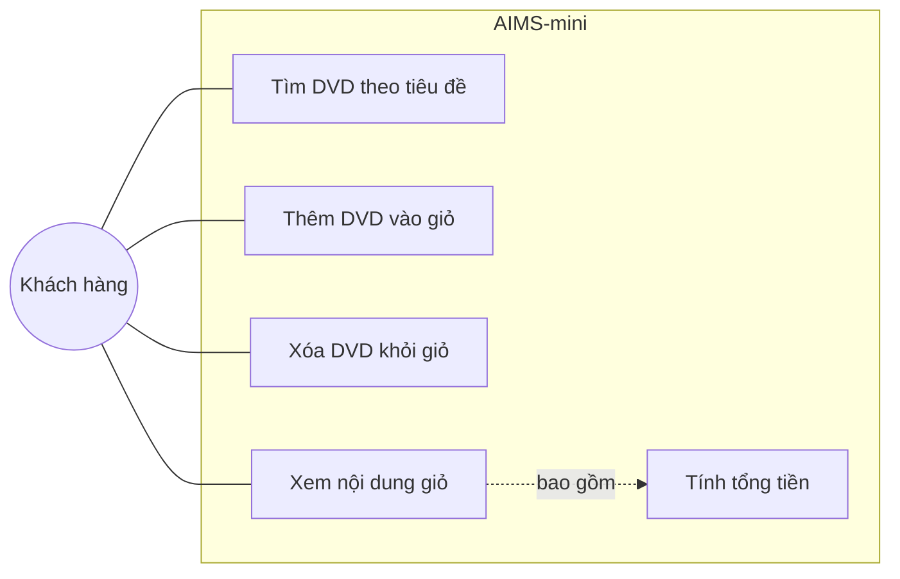

# Use Case Diagram — AIMS-mini

Sơ đồ các thao tác chính của khách hàng trong AIMS-mini.

```mermaid
flowchart LR
    Customer((Khách hàng))

    subgraph AIMS["AIMS-mini"]
        Search["Tìm DVD theo tiêu đề"]
        Add["Thêm DVD vào giỏ"]
        Remove["Xóa DVD khỏi giỏ"]
        View["Xem nội dung giỏ"]
        Total["Tính tổng tiền"]
    end

    Customer --- Search
    Customer --- Add
    Customer --- Remove
    Customer --- View
    View -.->|bao gồm| Total
```
